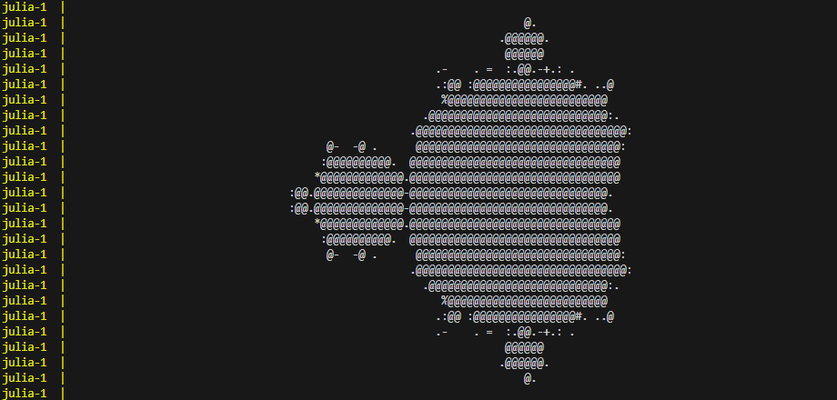
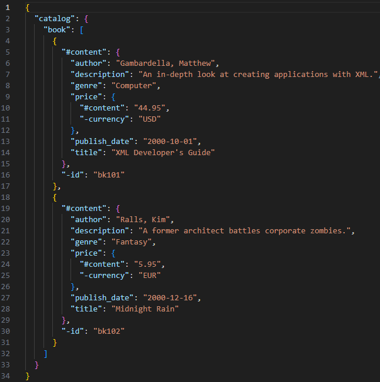
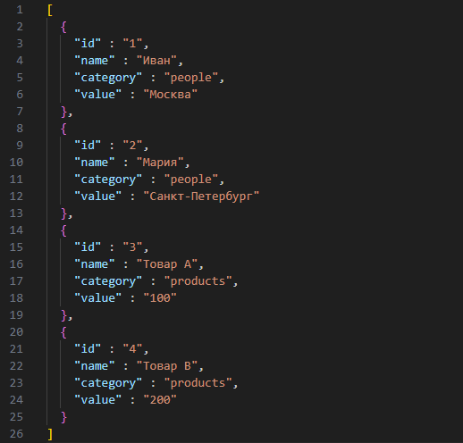
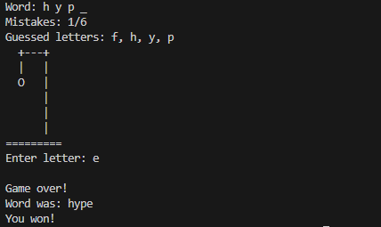

# Новые языки программирования

### Структура:
- [1. Многопоточность](#1-многопоточность)
- [2. Рекурсия](#2-рекурсия)
- [3. Конвертация](#3-конвертация)
- [4. Клиент-сервер](#4-клиент-сервер)
- [5. Парсинг данных](#5-дата-парсинг)

## 1. Многопоточность

### Rust - реализация ThreadSafe LruCache
Реализация потокобезопасного кеша по принципу **Least Recently Used** (Наименее недавно использованный)

### Erlang - реализация паттерна Supervisor c Workers
Реализация поиска простых чисел в заданном диапазоне с использованием многопоточности в рамках паттерна Supervisor

### Julia - реализация многопоточного вычисления множества Мандельброта
Реализация многопоточного вычисления с последующей отрисовкой результатов в консоли через ASCII-символы



## 2. Рекурсия

### Haskell - реализация построения и обхода B-дерева
Реализация вставки ключа в узел (с рекурсивным спуском и рекурсивным разделением узлов при переполнении) и симметричного обхода дерева (in-order traversal) для вывода всех ключей в отсортированном порядке.

### Ocaml - реализация алгоритма построения и печати синтаксического дерева для простых арифметических выражений

Исходные выражения записываются в файл ```input/input.txt```

### Lisp - реализация поиска всех уникальные разбиений положительного целого числа N.

Реализация поиска всех уникальные разбиений положительного целого числа N. на натуральных слагаемых (композиций) с помощью рекурсии с возвратом (backtracking).

## 3. Конвертация

### Elixir - реализация конвертора ```.xml``` в ```.json```

Исходные ```.xml``` файлы записываются в директорию **input**  
Итоговые ```.json``` файлы сохраняются в директорию **output**



### Scala - реализация конвертора ```.csv``` в ```.json```

Исходные ```.csv``` файлы записываются в директорию **input**  
Итоговые ```.json``` файлы сохраняются в директорию **output**



### D - реализация конвертора из YAML в TOML

Исходные ```.yaml``` файлы записываются в директорию **input**  
Итоговые ```.toml``` файлы сохраняются в директорию **output**

## 4. Клиент-сервер

### Ruby - реализовать игру в виселицу между клиентом и сервером

Запустите сервер в фоновом режиме:

```docker-compose up ruby-server --build -d```

Запустите клиент в интерактивном режиме:

```docker-compose run --rm ruby-client```

Играйте:



## 5. Дата-парсинг

### Groovy - реализовать валидатор номеров телефона
Реализация проверки номера на валидность и приведение его к единому общепринятому стандарту